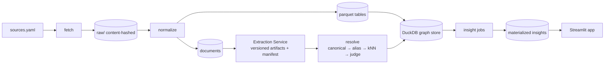

# PolicyGraph — Home-Insurance Non-Renewals, Contra Costa County, CA

**System design for a reproducible, continuously-updatable political knowledge graph.**
Prototype scope: one issue (residential insurance non-renewals), one geography (Contra Costa County).
Design scope: the same architecture must generalize to every issue × every geography.

---

## 1. Problem statement

Answer, for one county: *what is actually happening with home-insurance non-renewals, and what factors appear to be driving it?*

The interesting answer is not in any single source. It lives in the joins:

- CDI non-renewal counts by ZIP (tabular) × CAL FIRE hazard zones (geospatial) → *is hazard the driver?*
- CDI moratorium bulletins (PDF prose) × non-renewal time series → *do moratoriums prevent or defer?*
- Rate-filing decisions + regulations (prose) × non-renewal timing → *is the trigger regulatory, not meteorological?*
- FAIR Plan counts by ZIP × insurer exits → *where is the shadow market absorbing the loss?*

A system that makes those joins cheap, provenance-preserving, and re-runnable is the deliverable.

## 2. Design principles

1. **Structured data never touches an LLM.** CSV/XLSX/shapefiles are ingested deterministically. LLMs only read prose (bulletins, decisions, press releases) and only emit typed JSON.
2. **Canonical IDs before fuzzy matching.** ZIP, NAIC company code, bill number, fire name+year, FIPS. Entity resolution is a lookup first, an embedding/LLM match only for the residual.
3. **Every edge carries provenance.** `source_id`, `source_url`, `span` (quoted text), `extractor` (`deterministic` | `llm:<model>`), `confidence`.
4. **The graph is temporal, not overwritten.** Edges have `valid_from` / `valid_to`. Updates append; nothing is destructively rewritten. This is what makes "continuously updated" true.
5. **Idempotent, content-addressed pipeline.** Every stage is keyed by the hash of its inputs. Re-running on unchanged data is a no-op. Re-running on a new CDI release only re-processes the delta.
6. **Insights are precomputed, serving is read-only.** The app never runs LLMs or heavy joins at request time.

## 3. Architecture overview

```
┌──────────────────────────── INGEST (deterministic) ────────────────────────────┐
│  sources.yaml ──► fetch ──► raw/  (content-hashed, immutable)                  │
│     CDI non-renewal xlsx   CDI FAIR Plan xlsx   CAL FIRE FHSZ shp   ACS ZCTA   │
│     CDI bulletins (PDF)    CDI rate decisions   Cal-Access exports              │
└────────────────────────────────────┬───────────────────────────────────────────┘
                                     ▼
┌──────────────────────────── NORMALIZE ─────────────────────────────────────────┐
│  tabular  → parquet (typed, one table per source, schema-validated)            │
│  geospatial → ZIP×FHSZ overlap fractions (parquet)                             │
│  prose → documents table (doc_id = sha256, text, url, published_at)            │
└────────────────────────────────────┬───────────────────────────────────────────┘
                                     ▼
┌──────────────────────────── EXTRACT (external service) ─────────────────────────────┐
│  documents ──► Extraction Service (separate deploy) ──► pinned run manifest    │
│  Emits candidate entities + candidate edges with span + confidence             │
└────────────────────────────────────┬───────────────────────────────────────────┘
                                     ▼
┌──────────────────────────── RESOLVE ───────────────────────────────────────────┐
│  canonical lookup (NAIC, ZIP, bill#) → alias table → embedding kNN → LLM judge │
│  Output: mention → canonical entity_id, with resolution method recorded        │
└────────────────────────────────────┬───────────────────────────────────────────┘
                                     ▼
┌──────────────────────────── GRAPH STORE (DuckDB) ──────────────────────────────┐
│  entities · edges (temporal, provenance) · documents · extractions · aliases   │
└────────────────────────────────────┬───────────────────────────────────────────┘
                                     ▼
┌──────────────────────────── INSIGHT ───────────────────────────────────────────┐
│  SQL/NetworkX jobs → insight tables (hazard residuals, moratorium deferral,    │
│  regulatory-event alignment, FAIR Plan mirror). Materialized to parquet.       │
└────────────────────────────────────┬───────────────────────────────────────────┘
                                     ▼
┌──────────────────────────── SERVE ─────────────────────────────────────────────┐
│  Streamlit (map · graph · timeline · findings) reading only materialized files │
└────────────────────────────────────────────────────────────────────────────────┘
```



## 4. Repository layout

```
policygraph/
├── Makefile                     # make all | fetch | normalize | extract | resolve | graph | insights | app
├── pyproject.toml + uv.lock     # pinned deps
├── config/
│   ├── sources.yaml             # every external source: url, type, parser, expected sha256
│   ├── schema.sql               # DuckDB DDL (section 5)
│   └── extraction_schema.json   # JSON schema the LLM must emit (section 6)
├── data/
│   ├── raw/<source>/<sha256>.<ext>      # immutable, git-lfs or manifest-only
│   ├── normalized/*.parquet
│   ├── extractions/<doc_hash>.json      # LLM cache — committed, so runs are reproducible w/o API key
│   ├── graph.duckdb
│   └── insights/*.parquet
├── policygraph/
│   ├── fetch.py        # downloads, verifies hash, writes manifest
│   ├── normalize/      # one module per source type: cdi_nonrenewal.py, fhsz.py, acs.py, pdf_text.py
│   ├── extract.py      # LLM extraction, cached
│   ├── resolve.py      # entity resolution pipeline
│   ├── graph.py        # loads entities/edges into DuckDB, validates constraints
│   ├── insights/       # one module per finding
│   └── app.py          # Streamlit
├── tests/              # schema tests, golden extractions, resolution regression set
└── docs/
    ├── ARCHITECTURE.md (this file)
    ├── FINDINGS.md
    └── DATA_SOURCES.md
```

Reproduce from scratch: `git clone && uv sync && make all`. With committed `data/extractions/`, no API key is needed to rebuild the graph; `make extract FORCE=1` re-runs the LLM.

## 5. Data model (DuckDB)

```sql
CREATE TABLE entities (
  entity_id     TEXT PRIMARY KEY,     -- e.g. 'zip:94563', 'insurer:naic:25143', 'bill:ca:2018:SB824'
  type          TEXT NOT NULL,        -- ZIP | Insurer | Fire | Moratorium | Regulation | Official | RateFiling | County
  canonical_name TEXT NOT NULL,
  attrs         JSON                  -- type-specific: geometry ref, party, hazard_share, etc.
);

CREATE TABLE aliases (
  alias         TEXT,
  entity_id     TEXT REFERENCES entities,
  method        TEXT,                 -- canonical | manual | embedding | llm_judge
  confidence    DOUBLE,
  PRIMARY KEY (alias, entity_id)
);

CREATE TABLE documents (
  doc_id        TEXT PRIMARY KEY,     -- sha256 of bytes
  source        TEXT,                 -- 'cdi_bulletin' | 'cdi_rate_decision' | 'cdi_press' | ...
  url           TEXT,
  published_at  DATE,
  text          TEXT
);

CREATE TABLE edges (
  edge_id       TEXT PRIMARY KEY,     -- sha256(src, rel, dst, valid_from, doc_id)
  src           TEXT REFERENCES entities,
  rel           TEXT NOT NULL,        -- NONRENEWED_IN | PROTECTED_BY | TRIGGERED | HAZARD_SHARE | FILED | DECIDED | AUTHORED | DONATED_TO | HAS_FAIR_PLAN_POLICIES
  dst           TEXT REFERENCES entities,
  valid_from    DATE,
  valid_to      DATE,                 -- NULL = still valid
  props         JSON,                 -- count, amount, pct, decision, year ...
  doc_id        TEXT REFERENCES documents,   -- NULL for deterministic tabular edges (source recorded in props)
  span          TEXT,                 -- quoted evidence for LLM edges
  extractor     TEXT NOT NULL,        -- 'deterministic:cdi_nonrenewal_v1' | 'llm:<model snapshot id>'
  confidence    DOUBLE NOT NULL,
  ingested_at   TIMESTAMP DEFAULT now()
);

CREATE TABLE extractions (              -- raw LLM output, pre-resolution, for audit + replay
  doc_id        TEXT REFERENCES documents,
  schema_version TEXT,
  model         TEXT,
  output        JSON,
  created_at    TIMESTAMP,
  PRIMARY KEY (doc_id, schema_version, model)
);
```

**Why DuckDB and not Neo4j:** the graph is small (10⁴–10⁵ edges), the queries are mostly aggregations over time and geography, and a single file is reproducible and deployable. Section 9 covers when to migrate.

**Edge examples**

| src | rel | dst | props | extractor |
|---|---|---|---|---|
| insurer:naic:25143 (State Farm General) | NONRENEWED_IN | zip:94563 | `{year:2024, count:2220, insurer_initiated:true}` | deterministic |
| zip:94563 | HAZARD_SHARE | fhsz:very_high | `{pct:0.31}` | deterministic (geopandas overlay) |
| zip:91001 | PROTECTED_BY | moratorium:2025-01-07:eaton | `{valid_from:2025-01-07, valid_to:2026-01-07}` | llm (bulletin 2025-1) |
| fire:eaton:2025 | TRIGGERED | moratorium:2025-01-07:eaton | — | llm |
| insurer:naic:25143 | FILED | ratefiling:cdi:2025:sfg-emergency | `{requested_pct:22}` | llm |
| official:cdi:commissioner | DECIDED | ratefiling:… | `{outcome:"approved_interim", pct:17}` | llm |

## 6. Extraction: consumed from a separate service

The graph pipeline does **not** call an LLM. It submits documents to the Extraction Service (see `EXTRACTION_SERVICE.md`) and consumes versioned, validated artifacts via a pinned run manifest. The pipeline's only dependency is the extraction schema version; the model, prompt, and provider are the service's concern.

- `make extract` → enqueue every new `doc_id` → wait for the run manifest → store manifest path in `config/extraction_manifest.yaml`.
- `make graph` → load exactly the `extraction_id`s in the pinned manifest. Reproducible without network or API key because the artifacts are committed.
- Upgrading extraction = pinning a new manifest, reviewed as a PR that shows the edge diff.

The artifact shape the pipeline consumes (schema v1):

```json
{
  "entities": [
    {"mention": "State Farm General Insurance Company", "type": "Insurer", "hints": {"naic": null}},
    {"mention": "Eaton Fire", "type": "Fire", "hints": {"year": 2025, "county": "Los Angeles"}}
  ],
  "edges": [
    {
      "src_mention": "91001", "rel": "PROTECTED_BY", "dst_mention": "Eaton Fire moratorium",
      "valid_from": "2025-01-07", "valid_to": "2026-01-07",
      "span": "no admitted or non-admitted insurer shall issue a notice of cancellation or non-renewal ... 91001",
      "confidence": 0.95
    }
  ]
}
```

Validation (verbatim spans, closed relation vocabulary, anchor checks, date sanity) happens inside the service before an artifact is ever published; the pipeline re-checks only schema conformance on load as a contract test.

## 7. Entity resolution

Ordered, cheapest-first. Each step records its method on the alias row so quality can be audited per method.

1. **Canonical key** — if the mention contains/maps to a ZIP, NAIC code, bill number, or FIPS: resolved, confidence 1.0.
2. **Alias table** — exact match on a curated alias list (`"SFG"`, `"State Farm General"` → `insurer:naic:25143`). Seeded from CDI's admitted-insurer list; grows as LLM-judged matches are accepted.
3. **Embedding kNN** — `text-embedding` of mention vs canonical names within the same `type`; accept if cosine ≥ 0.92 *and* the runner-up is ≥ 0.05 lower.
4. **LLM judge** — for the ambiguous band, ask the model "same entity?" with both contexts. Accept ≥ 0.85, else create a `pending:` entity for manual review.

Type constraints prevent the classic failures: an Insurer mention can never resolve to an Official; a Fire is keyed by (name, year) so "Eaton Fire" never merges across decades.

## 8. Insight layer

Each finding is a module with a single function returning a DataFrame, materialized to `data/insights/`. The app only reads these.

| Finding | Computation | What it shows that sources don't |
|---|---|---|
| **Hazard residual** | OLS of non-renewal rate on `HAZARD_SHARE` across all CA ZIPs; report Contra Costa residuals | Orinda/Lafayette/Moraga are far above the hazard-predicted line → driver is insurer portfolio strategy, not fire risk |
| **Moratorium deferral** | Diff-in-diff: non-renewals in protected ZIPs in year N, N+1 vs matched unprotected ZIPs | Whether SB 824 moratoriums prevent or merely delay non-renewals |
| **Regulatory alignment** | Event-study: non-renewal deltas in ±2 quarters around `DECIDED` / `Regulation` edges vs around fire dates | Timing tracks CDI decisions more than fire seasons |
| **FAIR Plan mirror** | Correlation of insurer NONRENEWED_IN counts with HAS_FAIR_PLAN_POLICIES growth by ZIP | Where the state-backed insurer of last resort is absorbing the exits |
| **Actor centrality** | Betweenness on the entity graph restricted to Contra Costa ZIP neighborhoods | Which insurers/officials sit on the most paths from policy to outcome |

Every number in `FINDINGS.md` links to the query that produced it.

## 9. Scaling: bottlenecks and how the design addresses them

| Bottleneck | Where it bites | Design response | What changes at 100× |
|---|---|---|---|
| **Data volume** | 50 states × every county × dozens of sources | Sources declared in YAML; each source is an independent, hash-keyed job; parquet partitioned by `(state, source, year)` | Swap `make` for an orchestrator (Dagster/Airflow) running the same job DAG; DuckDB → Postgres/ClickHouse for the tabular layer; keep DuckDB for local repro |
| **LLM compute & cost** | Extraction over millions of pages | LLM sees prose only; extraction cached by doc hash; schema-constrained output cuts tokens; batch API for backfills | Tiered models (small model classifies "does this doc contain any target relation?" before the large model extracts); cost tracked per source in the manifest |
| **Latency** | User-facing queries | Nothing computed at request time; insights materialized; app reads parquet/DuckDB | Insight tables served from an API with a cache; graph exploration via precomputed neighborhood JSON per entity |
| **Entity resolution** | Name variants explode with scale | Canonical IDs first; typed alias table; embeddings only for residual; every resolution records its method | Move alias table + embeddings to a vector DB; add human review queue for `pending:` entities; measure precision/recall on a held-out labeled set per release |
| **Updates** | New CDI release, new bulletin, new fire | Temporal edges (`valid_from/valid_to`), append-only ingestion, delta detection via source hash | Source pollers on a schedule emit "new doc" events; only affected insight tables recompute (dependency tracked per insight module) |
| **Provenance & trust** | Political claims need receipts | Every edge has doc, span, extractor, confidence; span verified as verbatim | Confidence thresholds per surface (map shows ≥0.7, findings cite ≥0.9); UI exposes span on hover |
| **Schema drift** | Sources change formats | Per-source parser with schema validation tests; failures block the pipeline rather than corrupt the graph | Contract tests per source run on every fetch; versioned normalizers |
| **Cross-geography generalization** | New issue = new relations | Closed relation vocabulary is versioned; adding a relation is a schema bump + extraction prompt update + tests | Issue "packs": `sources.yaml` + relation vocabulary + insight modules bundled per issue |

## 10. Reproducibility guarantees

- `config/sources.yaml` pins each source URL and its expected sha256; `fetch` fails loudly on mismatch and records the new hash for review.
- `uv.lock` pins Python deps; `Dockerfile` pins the runtime.
- Extraction artifacts are committed under `data/extractions/` and pinned by `config/extraction_manifest.yaml`, so the graph rebuilds byte-identically without API access.
- `make all` is deterministic given the raw manifest; `tests/` includes golden-file tests for three bulletins and a 50-mention resolution regression set.
- `ARCHITECTURE.md`, `FINDINGS.md`, and the deployed app are generated from the same DuckDB file — no hand-copied numbers.

## 11. Deployment

- Streamlit Community Cloud from `main`; app reads `data/graph.duckdb` + `data/insights/*.parquet` committed to the repo (both < 50 MB for one county).
- No secrets required at runtime. `ANTHROPIC_API_KEY` only needed for `make extract FORCE=1`.
- Views: **Map** (pydeck choropleth: non-renewal rate, hazard share, residual, FAIR Plan growth, moratorium coverage by year), **Graph** (pyvis neighborhood explorer with span-on-hover), **Timeline** (non-renewals vs regulatory/fire events), **Findings** (rendered from `FINDINGS.md`).

## 12. What I would build next

1. **Change-data-capture on sources** — pollers that diff CDI/CAL FIRE pages weekly and open a PR with the new raw hash; the pipeline is already delta-safe.
2. **Human review queue** for `pending:` entities and sub-threshold edges; accepted decisions feed back into the alias table.
3. **Second issue pack** (e.g., data-center rezoning, Loudoun County) to prove the relation vocabulary and pipeline generalize without code changes to the core.
4. **Causal layer** — replace the event-study heuristics with synthetic-control estimates per ZIP so "appears to drive" becomes a defensible effect size.
5. **Precision/recall dashboard** per extractor and resolver method, computed against a growing labeled set, so quality is measured per release instead of assumed.

## 13. Prototype deviations (2026-09-04)

What the shipped prototype does differently from the design above, and why.

- **No per-insurer edges.** CDI's public ZIP data carries no company name or NAIC code. `NONRENEWED_IN` runs from `market:ca:voluntary` to each ZIP with `count`, `policies`, the insurer/insured split where the release has it, and `release`.
- **Two CDI releases, not one series.** The 2015–2021 and 2020–2023 workbooks disagree on their overlapping years. Both are loaded, tagged by `release`, and never merged; each insight names the release it used.
- **FHSZ comes from CAL FIRE's ArcGIS feature services** as paged GeoJSON (`arcgis_geojson` source type), not a shapefile. ZCTA boundaries are the generalized cartographic file.
- **FAIR Plan counts come from the FAIR Plan's own PDF** (fiscal-year policies in force by ZIP), not a CDI workbook.
- **Extraction runs on an open-weight model** (Fireworks `gpt-oss-120b`) through the `openai_compat` adapter; the Anthropic adapter remains available. Artifacts record `rejected` validator errors for audit.
- **Resolver has canonical rules for fires and moratoria** keyed on the mention conventions in the prompt (`Eaton Fire 2025`, `Eaton Fire moratorium 2025-01-07`), so no embedding or LLM-judge step was needed for the bulletins.
- **Insights add an `evidence` table** (every LLM edge with span and source URL) so the app shows receipts without shipping the DuckDB file.
